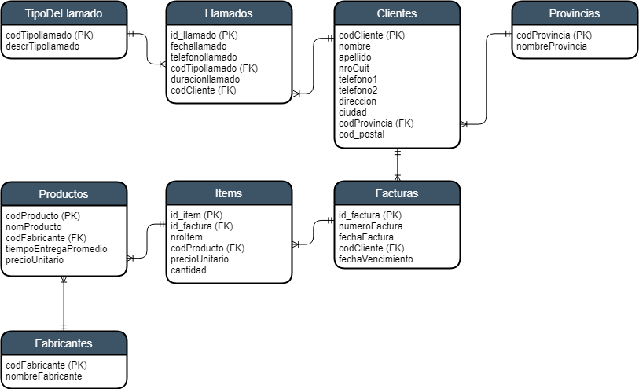

# Clase 2

Dadas las siguientes estructuras,

  1. Normalice las entidades, aplique denormalización en los casos que crea convenientes.
  1. Genere un Diagrama de Entidad Relación, indicando la cardinalidad y las   claves primarias y foráneas.
  1. Creación de Tablas y contraints ó restricciones (PK,FK, NOT NULL, UNIQUE, CHECK, DEFAULT)


#### Clientes

codCliente, nombre, apellido, nroCuit, teléfono1, teléfono2, dirección, ciudad, codProvincia, nombreProvincia, cod_postal, id_llamado1, fechallamado1, teléfonollamado1, codTipollamado1, descrTipollamado1,duracionllamado1, id_llamado2, fechallamado2, teléfonollamado2, codTipollamado2, descrTipollamado2,duracionllamado2, idLlamadoN, fechallamadoN, teléfonollamadoN, codTipollamadoN, descrTipollamadoN, duracionllamadoN

#### Facturas
numeroFactura, fechaFactura, codCliente, nombre, apellido, nroCuit, fechaVencimiento, nroItem1, codProducto1, nomProducto1, codFabricante1, nombreFabricante1, tiempEntregaPromedio1, precioUnitario1, cantidad1, nroItem2, codProducto2, nomProducto2, codFabricante2, nombreFabricante2, tiempEntregaPromedio2, precioUnitario2, cantidad2, ..., nroItem20, codProducto20, nomProducto20, codFabricante20, nombreFabricante20, tiempoEntregaPromedio20, precioUnitario20, cantidad20


### Solución



```sql
create table TipoDeLlamado (
  codTipollamado SMALLINT PRIMARY KEY,
  descrTipollamado varchar(60)
)

create table Llamados (
  id_llamado INTEGER PRIMARY KEY,
  fechallamado DATE,
  telefonollamado varchar(60),
  codTipollamado SMALLINT REFERENCES TipoDeLlamado,
  duracionllamado NUMERIC(12, 2),
  codCliente INTEGER REFERENCES Clientes
)

create table Clientes (
  codCliente INTEGER PRIMARY KEY,
  nombre varchar(60) NOT NULL,
  apellido varchar(60) NOT NULL,
  nroCuit BIGINT UNIQUE,
  telefono1 varchar(60),
  telefono2 varchar(60),
  direccion varchar(60),
  ciudad varchar(60),
  cod_postal varchar(10),
  codProvincia SMALLINT REFERENCES Provincias
)

create table Provincias (
  codProvincia SMALLINT PRIMARY KEY,
  nombreProvincia varchar(60)
)

create table Productos (
  codProducto INTEGER PRIMARY KEY,
  nomProducto varchar(60),
  codFabricante INTEGER REFERENCES Fabricantes,
  tiempoEntregaPromedio SMALLINT,
  precioUnitario NUMERIC(12, 2)
)

create table Items (
  id_item INTEGER PRIMARY KEY,
  id_factura INTEGER REFERENCES Facturas,
  nroItem SMALLINT,
  codProducto INTEGER REFERENCES Productos,
  precioUnitario NUMERIC(12, 2),
  cantidad SMALLINT
)

create table Facturas (
  id_factura INTEGER PRIMARY KEY,
  numeroFactura INTEGER UNIQUE,
  fechaFactura DATE,
  codCliente INTEGER REFERENCES Clientes,
  fechaVencimiento DATE
)

create table Fabricantes (
  codFabricante INTEGER PRIMARY KEY,
  nombreFabricante varchar(60)
)
```